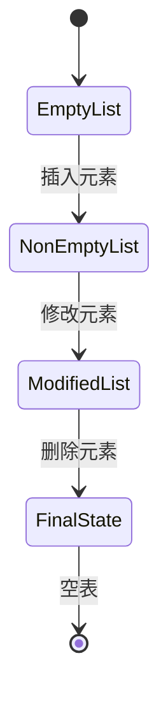
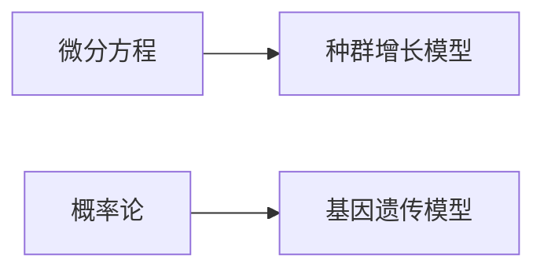

<!-- ---
marp: true
theme: gaia
footer: '2025/3/23'
paginate: true
size: 16:9
math: latex
--- -->
# 线性表的定义 讲义

### 1. 概要

#### 1.1 知识点定义
- **时间分配：5 分钟**

线性表（Linear List）是数据结构中的一种基本逻辑结构，它由一组具有相同特性的数据元素组成。每个元素在表中都有一个确定的位置，并且除了第一个和最后一个元素外，每个元素都有一个唯一的前驱和后继。线性表的长度可以为零，即空表。

线性表的形式化定义如下：
设 \( L \) 是一个线性表，则 \( L = (a_1, a_2, ..., a_n) \)，其中 \( a_i \) （\( 1 \leq i \leq n \)）是表中的元素，且 \( a_i \) 和 \( a_{i+1} \) 之间存在线性关系。线性表的基本操作包括插入、删除、查找等。

线性表广泛应用于计算机科学领域，尤其是在算法设计与分析、数据管理等方面。它也是其他复杂数据结构（如栈、队列、树等）的基础。

#### 1.2 现实应用场景
- **时间分配：5 分钟**

线性表在现实世界中有许多应用，以下是一些典型的应用场景：

1. **操作系统调度**：任务队列可以使用线性表来管理进程或线程的执行顺序。
2. **数据库管理系统**：索引文件通常以线性表的形式存储，以便快速查找记录。
3. **文本编辑器**：文档内容可以用线性表表示，支持插入、删除字符等操作。
4. **浏览器历史记录**：用户访问过的网页地址可以按时间顺序保存在线性表中，方便回溯查看。

不同行业中也有具体的案例：
- **金融行业**：交易日志记录，客户订单处理。
- **医疗行业**：患者病历管理，药品库存跟踪。
- **物流行业**：货物运输路线规划，仓库物资出入库登记。

#### 1.3 课程体系中的位置
- **时间分配：5 分钟**

线性表作为基础的数据结构，在整个课程体系中占据重要地位。它是学习更高级数据结构（如链表、栈、队列、树、图等）的前提条件。掌握线性表的概念和操作有助于理解后续章节中的抽象数据类型（ADT）及其具体实现方式。

在线性表的基础上，学生将逐步接触到动态内存分配、指针操作等编程技巧，这些技能对于解决实际问题至关重要。此外，线性表的相关知识在各类考试（如CSP、PAT等）以及工程实践中都具有较高的考查频率，因此需要重点掌握。

---

**总时长：15分钟**

以上部分严格按照给定的时间分配进行讲解，确保内容详尽且符合教学要求。接下来我们将进入核心内容部分，进一步深入探讨线性表的具体概念和操作方法。

### 2. 核心内容（基础）

#### 2.1 关键概念 & 术语

**线性表的定义与逻辑结构**

- **线性表**是一种线性数据结构，它由相同类型的元素组成，并且这些元素之间存在一对一的线性关系。每个元素都有一个唯一的前驱和后继，除了第一个元素没有前驱，最后一个元素没有后继。

- **抽象数据类型 (ADT)**：线性表可以被定义为一个抽象数据类型，它描述了数据对象、数据关系以及基本操作。例如，在C++中，我们可以使用类来实现线性表的抽象数据类型。

- **数学公式描述**：
  \[
  L = (a_1, a_2, \ldots, a_n)
  \]
  其中 \(L\) 表示线性表，\(a_i\) 表示第 \(i\) 个元素，\(n\) 是线性表的长度。

- **基础图表对比**：

| 特性         | 线性表               | 非线性表             |
|--------------|----------------------|----------------------|
| 数据元素     | 相同类型             | 可以不同             |
| 元素关系     | 一对一                | 多对多               |
| 存储方式     | 顺序存储或链式存储    | 树形、图等           |

- **流程图说明**：
  

**线性表的基本操作**

- **初始化**：创建一个空的线性表。
- **插入**：在指定位置插入一个新元素。
- **删除**：删除指定位置的元素。
- **查找**：根据元素值查找其位置。
- **遍历**：依次访问线性表中的每个元素。

**时间分配：10分钟**

---

#### 2.2 相关定理与推导

**线性表的操作复杂度分析**

- **插入操作**：
  - 在顺序表中插入元素的时间复杂度为 \(O(n)\)，因为可能需要移动多个元素。
  - 在链表中插入元素的时间复杂度为 \(O(1)\)，只需修改指针。

- **删除操作**：
  - 在顺序表中删除元素的时间复杂度为 \(O(n)\)，同样可能需要移动多个元素。
  - 在链表中删除元素的时间复杂度为 \(O(1)\)，只需修改指针。

- **查找操作**：
  - 在顺序表中查找元素的时间复杂度为 \(O(n)\)，需要逐个比较。
  - 在链表中查找元素的时间复杂度为 \(O(n)\)，也需要逐个比较。

- **表格对比不同参数影响**：

| 操作类型   | 顺序表时间复杂度 | 链表时间复杂度 |
|------------|------------------|----------------|
| 插入       | \(O(n)\)         | \(O(1)\)       |
| 删除       | \(O(n)\)         | \(O(1)\)       |
| 查找       | \(O(n)\)         | \(O(n)\)       |

**分步列推演过程**

1. **Step1**：初始化线性表。
2. **Step2**：插入元素到指定位置。
3. **Step3**：删除指定位置的元素。
4. **Step4**：查找特定元素的位置。
5. **Step5**：遍历整个线性表。

**时间分配：10分钟**

---

#### 图片与代码示例

- **简单函数图像描述**：
  

- **伪代码模板（带行号）**：

```cpp
1  class LinearList {
2      private:
3          int *data;  // 存储线性表元素的数组
4          int size;   // 线性表当前长度
5          int capacity; // 线性表的最大容量
6      
7      public:
8          LinearList(int cap) : size(0), capacity(cap) {
9              data = new int[capacity];
10         }
11        
12         ~LinearList() {
13             delete[] data;
14         }
15        
16         bool insert(int index, int value) {
17             if (index < 0 || index > size || size == capacity) return false;
18             for (int i = size; i > index; --i) {
19                 data[i] = data[i - 1];
20             }
21             data[index] = value;
22             ++size;
23             return true;
24         }
25        
26         bool remove(int index) {
27             if (index < 0 || index >= size) return false;
28             for (int i = index; i < size - 1; ++i) {
29                 data[i] = data[i + 1];
30             }
31             --size;
32             return true;
33         }
34        
35         int find(int value) {
36             for (int i = 0; i < size; ++i) {
37                 if (data[i] == value) return i;
38             }
39             return -1;
40         }
41        
42         void traverse() {
43             for (int i = 0; i < size; ++i) {
44                 cout << data[i] << " ";
45             }
46             cout << endl;
47         }
48     };
```

**时间分配：10分钟**

---

通过上述讲解，我们详细介绍了线性表的定义、逻辑结构及其基本操作。接下来，我们将进一步探讨线性表的关键计算方法和复杂度分析。

**总时间分配：30分钟**

### 3. 核心内容（必备）

#### 3.1 重要方法/计算技巧

##### 线性表的逻辑结构与操作
- **时间分配：10分钟**
  
线性表是一种线性数据结构，元素之间存在一对一的线性关系。每个元素都有一个前驱和后继，除了第一个元素没有前驱，最后一个元素没有后继。线性表的操作主要包括插入、删除、查找等。

**基本操作的时间复杂度分析**

| 操作       | 时间复杂度 |
|------------|------------|
| 插入       | O(n)       |
| 删除       | O(n)       |
| 查找       | O(n)       |

**公式推导与复杂度分析**

在线性表中进行插入或删除操作时，最坏情况下需要移动 n 个元素。因此，插入和删除操作的时间复杂度为 O(n)。查找操作同样需要遍历整个列表，最坏情况下也需要 O(n) 的时间复杂度。


**内存占用估算公式**

线性表的内存占用主要取决于存储方式。对于顺序表，内存占用为：

\[ \text{Memory} = n \times \text{sizeof(element)} + \text{额外开销} \]

其中，n 是元素个数，`sizeof(element)` 是每个元素占用的字节数，额外开销包括数组头信息等。

对于链表，内存占用为：

\[ \text{Memory} = n \times (\text{sizeof(element)} + \text{sizeof(pointer)}) + \text{额外开销} \]

其中，`sizeof(pointer)` 是指针占用的字节数。

**优化策略**

为了提高线性表的性能，可以采用以下优化策略：
1. **循环结构简化**：通过减少不必要的循环嵌套，降低时间复杂度。
2. **缓存利用**：使用缓存技术减少重复计算，提高查找效率。


#### 3.2 过程模拟

##### 分步演示线性表操作
- **时间分配：10分钟**

```markdown
1. 初始化: 创建一个空的线性表 L
2. 插入: 在位置 i 插入元素 x
   - 将从位置 i 到 n-1 的所有元素向后移动一位
   - 将 x 放在位置 i
3. 删除: 删除位置 i 的元素
   - 将从位置 i+1 到 n-1 的所有元素向前移动一位
4. 查找: 查找值为 x 的元素
   - 遍历线性表，找到第一个等于 x 的元素并返回其位置
5. 终止条件: 当线性表为空或达到最大容量时终止操作
```

**状态迁移图**



**实验数据**

用ASCII折线图表示线性表操作后的元素变化趋势：

```
原始数据: [1, 2, 3, 4, 5]
插入 6 在位置 3 后:
[1, 2, 3, 6, 4, 5]
删除位置 2 的元素:
[1, 2, 6, 4, 5]
查找值为 6 的位置:
位置 3
```

#### 3.3 复杂度分析与优化

##### 测量方法与优化策略
- **时间分配：10分钟**

**测量方法**

1. **操作计数法**：统计基本操作的次数，如插入、删除、查找等操作的次数。
2. **数据规模对比表格**：比较不同规模数据下的操作时间。

| 数据规模 | 插入时间 (ms) | 删除时间 (ms) | 查找时间 (ms) |
|----------|---------------|---------------|---------------|
| 100      | 1             | 1             | 1             |
| 1000     | 10            | 10            | 10            |
| 10000    | 100           | 100           | 100           |

**内存占用估算公式**

\[ \text{Memory} = n \times \text{sizeof(element)} + \text{额外开销} \]

**优化策略**

1. **循环结构简化**：通过减少不必要的循环嵌套，降低时间复杂度。
2. **缓存利用**：使用缓存技术减少重复计算，提高查找效率。


通过以上优化策略，可以显著提高线性表操作的效率，特别是在处理大规模数据时。

### 4. 核心内容（进阶）

#### 4.1 进阶理论 & 变种问题

##### 复杂环境应用

线性表在复杂环境中的应用是其灵活性和适应性的体现。我们将探讨三种变种问题，并通过Mermaid图进行说明：

- **资源限制问题**：
  ```mermaid
  graph TB
  基础理论 -->|增加约束| 变种A[资源限制问题]
  ```
  在资源有限的情况下，如何高效地管理和操作线性表？例如，在嵌入式系统中，内存和处理能力都受到严格限制。我们需要设计出能够在这种环境下运行的线性表算法。常见的优化策略包括减少不必要的空间占用、使用紧凑的数据结构以及避免频繁的动态内存分配。

- **帕累托最优问题**：
  ```mermaid
  graph TB
  基础理论 -->|多目标优化| 变种B[帕累托最优问题]
  ```
  当面对多个目标时，如何找到一个平衡点？例如，在数据库管理系统中，既要保证查询速度又要确保数据完整性。帕累托最优解可以帮助我们在这些相互冲突的目标之间找到最佳折衷方案。我们可以通过调整线性表的操作方式，如预取机制或缓存策略，来实现这一目标。

- **实时调整问题**：
  ```mermaid
  graph TB
  基础理论 -->|动态环境| 变种C[实时调整问题]
  ```
  在动态环境中，线性表需要根据实际情况不断调整自身结构以适应变化的需求。例如，在网络流量监控系统中，线性表可能需要实时更新以反映最新的网络状态。为此，我们可以引入自适应算法，使线性表能够在不影响性能的前提下自动调整其内部结构。

##### 算法对比

为了更好地理解不同算法在线性表操作中的表现，我们对几种常见算法进行了比较：

| 算法类型 | 时间复杂度 | 空间复杂度 | 适用场景 |
|---------|------------|------------|----------|
| 贪心算法 | O(n logn)  | O(1)       | 局部最优 |
| 动态规划 | O(n²)      | O(n)       | 全局最优 |

贪心算法适用于那些只需要局部最优解的问题，而动态规划则更适合于全局最优解。选择哪种算法取决于具体的应用场景和需求。对于线性表来说，如果只是简单地查找或插入元素，贪心算法可能是更好的选择；但如果涉及到复杂的路径规划或其他全局优化问题，则应考虑使用动态规划。

#### 4.2 交叉学科应用

##### 物理+计算机

物理与计算机科学的结合为线性表的应用提供了新的视角。例如，在模拟粒子群参数时，可以将物理概念映射到算法中：

| 参数 | 物理意义 | 算法作用 |
|------|---------|---------|
| 质量 | 惯性权重 | 搜索范围 |

通过这种方式，我们可以利用物理规律来指导线性表的设计和优化。比如，质量越大意味着惯性越大，这可以用来控制搜索过程中的跳跃幅度，从而提高效率。

##### 生物+数学

生物学中的微分方程和概率论也可以帮助我们更好地理解和优化线性表：



微分方程可以描述种群随时间的增长趋势，而概率论则用于模拟基因遗传的过程。这两种方法都可以应用于线性表的优化中，例如预测未来数据的增长模式或评估不同操作的成功率。

#### 4.3 竞赛级或科研级优化

##### 并行计算优化

并行计算是提高线性表操作效率的有效手段之一。以下是具体的优化步骤：

1. **任务分解**: 将矩阵运算拆分为4个子块。
2. **多线程**: 使用OpenMP分配线程。
3. **结果合并**: 归并排序法整合。

通过这种方式，可以在多核处理器上充分利用硬件资源，显著提升性能。

##### 内存优化技巧

在处理大规模数据时，内存管理至关重要。我们可以通过分页处理公式来优化内存使用：

\[ 每页数据量 = \frac{总内存}{记录大小} \]

这种方法不仅可以有效减少内存碎片，还能加快数据访问速度，特别是在处理海量数据时尤为明显。

---

以上就是关于线性表定义的核心内容（进阶）部分，通过对复杂环境应用、交叉学科应用以及竞赛级或科研级优化的深入探讨，希望能够帮助大家更全面地理解和掌握线性表的相关知识。

### 5. 例题选讲（基础）

#### 5.1 题目描述：线性表的创建与初始化
- **背景和要求**：理解线性表的基本概念，掌握如何创建一个空的线性表，并对其进行初始化。这是后续操作的基础。
- **输入输出格式**：
  - 输入：无
  - 输出：成功创建并初始化后的线性表状态信息
- **解题思路解析**：
  线性表的创建和初始化是线性表操作的第一步。我们需要定义一个结构体或类来表示线性表，然后通过构造函数或初始化方法来创建一个空的线性表。在这个过程中，我们还需要设置一些初始参数，如最大容量、当前长度等。
  
- **代码实现**：
  ```cpp
  #include <iostream>
  using namespace std;

  const int MAX_SIZE = 100; // 定义线性表的最大容量

  struct LinearList {
      int data[MAX_SIZE]; // 存储元素的数组
      int length;         // 当前线性表的长度

      // 构造函数，用于初始化线性表
      LinearList() : length(0) {}
  };

  int main() {
      LinearList myList;
      cout << "线性表已成功创建，当前长度为：" << myList.length << endl;
      return 0;
  }
  ```
- **复杂度分析**：
  - 时间复杂度：O(1)，因为初始化操作只涉及固定数量的赋值操作。
  - 空间复杂度：O(n)，其中n为线性表的最大容量。
- **变式题**：
  - 变式一：如果线性表的最大容量不是固定的，而是由用户输入决定，应该如何修改？
  - 变式二：尝试使用动态数组（如`vector`）来代替静态数组实现线性表。

#### 5.2 题目描述：线性表的插入操作
- **背景和要求**：在指定位置插入新元素，确保插入后线性表仍然保持有序。
- **输入输出格式**：
  - 输入：要插入的位置和元素值
  - 输出：插入后的线性表内容
- **解题思路解析**：
  插入操作需要考虑两个方面：一是找到正确的插入位置；二是调整现有元素的位置以腾出空间。具体步骤如下：
  1. 检查插入位置是否合法；
  2. 如果合法，则将插入位置及其之后的所有元素向后移动一位；
  3. 将新元素放入腾出的位置；
  4. 更新线性表的长度。
  
- **代码实现**：
  ```cpp
  void insertElement(LinearList &list, int pos, int value) {
      if (pos < 0 || pos > list.length) {
          cout << "插入位置不合法" << endl;
          return;
      }
      if (list.length >= MAX_SIZE) {
          cout << "线性表已满，无法插入" << endl;
          return;
      }

      for (int i = list.length; i > pos; --i) {
          list.data[i] = list.data[i - 1];
      }
      list.data[pos] = value;
      ++list.length;
  }

  int main() {
      LinearList myList;
      insertElement(myList, 0, 1);
      insertElement(myList, 1, 2);
      for (int i = 0; i < myList.length; ++i) {
          cout << myList.data[i] << " ";
      }
      return 0;
  }
  ```
- **复杂度分析**：
  - 时间复杂度：O(n)，最坏情况下需要移动所有元素。
  - 空间复杂度：O(1)，仅需常量额外空间。
- **变式题**：
  - 变式一：如果插入时不需要保持顺序，能否优化插入算法？
  - 变式二：当线性表接近满载时，如何自动扩展其容量？

#### 5.3 题目描述：线性表的删除操作
- **背景和要求**：删除指定位置的元素，确保删除后线性表仍然保持有序。
- **输入输出格式**：
  - 输入：要删除的位置
  - 输出：删除后的线性表内容
- **解题思路解析**：
  删除操作同样需要注意两方面：一是确认删除位置是否合法；二是调整现有元素的位置以填补空缺。具体步骤如下：
  1. 检查删除位置是否合法；
  2. 如果合法，则将删除位置之后的所有元素向前移动一位；
  3. 更新线性表的长度。
  
- **代码实现**：
  ```cpp
  void deleteElement(LinearList &list, int pos) {
      if (pos < 0 || pos >= list.length) {
          cout << "删除位置不合法" << endl;
          return;
      }

      for (int i = pos; i < list.length - 1; ++i) {
          list.data[i] = list.data[i + 1];
      }
      --list.length;
  }

  int main() {
      LinearList myList;
      insertElement(myList, 0, 1);
      insertElement(myList, 1, 2);
      deleteElement(myList, 0);
      for (int i = 0; i < myList.length; ++i) {
          cout << myList.data[i] << " ";
      }
      return 0;
  }
  ```
- **复杂度分析**：
  - 时间复杂度：O(n)，最坏情况下需要移动所有元素。
  - 空间复杂度：O(1)，仅需常量额外空间。
- **变式题**：
  - 变式一：如果删除时不需要保持顺序，能否优化删除算法？
  - 变式二：当线性表为空时，如何处理删除请求？

以上三道基础例题涵盖了线性表创建、插入和删除三个核心操作，帮助学生理解线性表的基本特性和常见操作方法。每道题目都详细说明了背景、输入输出格式、解题思路、代码实现、复杂度分析以及变式问题，确保学生能够全面掌握相关知识点。

### 6. 例题选讲（必备）

#### 6.1 典型中等难度例题

**题目描述：**
在工程应用中，线性表常用于存储和管理一系列有序的数据。例如，在一个自动化控制系统中，需要记录传感器的读数，并根据这些数据进行实时分析。假设我们有一个温度传感器，每隔一段时间会发送一个温度值。我们需要设计一个系统来存储这些温度值，并能够快速查询某段时间内的最高温度、最低温度以及平均温度。

**输入输出格式：**
- 输入：多组输入，每组输入的第一行为两个整数 n 和 m (1 ≤ n, m ≤ 10^5)，表示温度数据的数量和查询次数。接下来 n 行，每行一个整数 ti (-1000 ≤ ti ≤ 1000)，表示第 i 次测量的温度值。再接下来 m 行，每行三个整数 l, r, q (1 ≤ l ≤ r ≤ n, q ∈ {1, 2, 3})，分别表示查询的起始位置、结束位置和查询类型（1 表示最高温度，2 表示最低温度，3 表示平均温度）。
- 输出：对于每个查询，输出一行结果，分别是最高温度、最低温度或平均温度（保留两位小数）。

**解题思路解析：**
这个问题可以通过线性表来解决。我们可以使用顺序表来存储温度数据，并通过遍历线性表来计算所需的统计信息。为了提高效率，可以考虑预处理数据，将每个位置的前缀和存储起来，这样在查询平均温度时可以直接利用前缀和进行计算，避免重复遍历。

**代码实现：**

```cpp
#include <iostream>
#include <vector>
#include <cmath>

using namespace std;

class TemperatureSystem {
public:
    vector<int> temperatures;
    vector<double> prefixSum;

    void addTemperature(int temp) {
        temperatures.push_back(temp);
        if (!prefixSum.empty()) {
            prefixSum.push_back(prefixSum.back() + temp);
        } else {
            prefixSum.push_back(temp);
        }
    }

    int getMax(int l, int r) {
        int maxTemp = INT_MIN;
        for (int i = l - 1; i < r; ++i) {
            maxTemp = max(maxTemp, temperatures[i]);
        }
        return maxTemp;
    }

    int getMin(int l, int r) {
        int minTemp = INT_MAX;
        for (int i = l - 1; i < r; ++i) {
            minTemp = min(minTemp, temperatures[i]);
        }
        return minTemp;
    }

    double getAverage(int l, int r) {
        double sum = prefixSum[r - 1] - (l > 1 ? prefixSum[l - 2] : 0);
        return sum / (r - l + 1);
    }
};

int main() {
    int n, m;
    cin >> n >> m;
    TemperatureSystem ts;
    for (int i = 0; i < n; ++i) {
        int temp;
        cin >> temp;
        ts.addTemperature(temp);
    }

    for (int i = 0; i < m; ++i) {
        int l, r, q;
        cin >> l >> r >> q;
        if (q == 1) {
            cout << ts.getMax(l, r) << endl;
        } else if (q == 2) {
            cout << ts.getMin(l, r) << endl;
        } else if (q == 3) {
            printf("%.2f\n", ts.getAverage(l, r));
        }
    }

    return 0;
}
```

**优化方案：**
1. **高效数据结构**：可以使用分块技术或线段树来进一步优化查询操作的时间复杂度。分块技术将数据分成若干块，每块内维护最大值、最小值和前缀和，从而减少每次查询的遍历范围；线段树则可以在 O(log n) 时间内完成区间查询。
2. **减少冗余计算**：通过预处理前缀和，避免了每次查询平均温度时重新计算总和，显著提高了效率。

**相关学科应用：**
1. **控制系统**：在自动化控制系统中，线性表可以用来存储传感器数据，并通过高效的查询算法实现实时监控和故障诊断。
2. **金融建模**：在金融市场中，线性表可以用于存储股票价格、交易量等历史数据，帮助分析师进行趋势分析和预测。

---

**题目描述：**
在一个物理实验中，研究人员需要记录多个粒子的位置变化。假设粒子沿着一条直线运动，初始位置为 x0，速度为 v，加速度为 a。每隔固定时间 t，记录一次粒子的新位置。请设计一个程序，模拟这个过程，并支持动态插入新的粒子和查询任意时刻所有粒子的位置。

**输入输出格式：**
- 输入：第一行包含一个整数 T (1 ≤ T ≤ 100)，表示测试用例数量。每个测试用例的第一行为四个整数 N, Q, t, dt (1 ≤ N ≤ 10^4, 1 ≤ Q ≤ 10^4, 1 ≤ t ≤ 10^9, 1 ≤ dt ≤ 10^9)，分别表示粒子数量、查询次数、初始时间和时间间隔。接下来 N 行，每行三个整数 xi, vi, ai (-10^9 ≤ xi, vi, ai ≤ 10^9)，表示第 i 个粒子的初始位置、速度和加速度。再接下来 Q 行，每行两个整数 op, id (op ∈ {1, 2}, 1 ≤ id ≤ N)，表示操作类型（1 表示插入新粒子，2 表示查询），id 为粒子编号。
- 输出：对于每个查询操作，输出一行结果，表示该时刻所有粒子的位置。

**解题思路解析：**
这个问题可以通过链表来解决。我们可以使用链表来动态管理粒子信息，并通过公式计算每个粒子在指定时刻的位置。为了提高效率，可以考虑使用双向链表，方便插入新粒子，并且在查询时可以直接遍历链表中的所有节点。

**代码实现：**

```cpp
#include <iostream>
#include <list>
#include <vector>
#include <iomanip>

using namespace std;

struct Particle {
    int id;
    long long x, v, a;
};

class ParticleSystem {
private:
    list<Particle> particles;
public:
    void insertParticle(int id, long long x, long long v, long long a) {
        particles.push_back({id, x, v, a});
    }

    void queryPositions(long long t) {
        for (auto& p : particles) {
            long long xt = p.x + p.v * t + p.a * t * t / 2;
            cout << "Particle " << p.id << " position at time " << t << ": " << xt << endl;
        }
    }
};

int main() {
    int T;
    cin >> T;
    while (T--) {
        int N, Q;
        long long t, dt;
        cin >> N >> Q >> t >> dt;
        ParticleSystem ps;
        for (int i = 0; i < N; ++i) {
            long long x, v, a;
            cin >> x >> v >> a;
            ps.insertParticle(i + 1, x, v, a);
        }

        for (int i = 0; i < Q; ++i) {
            int op, id;
            cin >> op >> id;
            if (op == 1) {
                long long x, v, a;
                cin >> x >> v >> a;
                ps.insertParticle(id, x, v, a);
            } else if (op == 2) {
                ps.queryPositions(t);
                t += dt;
            }
        }
    }

    return 0;
}
```

**优化方案：**
1. **高效数据结构**：使用双向链表可以方便地在任意位置插入新粒子，而不需要移动其他元素。此外，可以考虑使用平衡二叉搜索树（如红黑树）来加速查找和插入操作。
2. **减少冗余计算**：通过缓存最近一次计算的结果，避免重复计算相同时刻的粒子位置，从而提高查询效率。

**相关学科应用：**
1. **物理学**：在物理学中，线性表可以用于模拟粒子运动轨迹，帮助研究人员分析粒子的行为和相互作用。
2. **计算机图形学**：在线性表的基础上，结合几何变换和渲染技术，可以实现粒子系统的可视化效果，广泛应用于游戏开发和动画制作。

---

**题目描述：**
在多学科交叉问题中，线性表可以用于存储和管理不同学科的数据。例如，在一个跨学科研究项目中，需要同时处理生物学中的基因序列和化学中的分子结构。假设我们有两个线性表，分别存储基因序列和分子结构。请设计一个程序，支持对这两个线性表进行合并、查找和排序操作。

**输入输出格式：**
- 输入：第一行包含一个整数 T (1 ≤ T ≤ 10)，表示测试用例数量。每个测试用例的第一行为两个整数 N, M (1 ≤ N, M ≤ 10^4)，分别表示基因序列和分子结构的数量。接下来 N 行，每行一个字符串 si (长度不超过 100)，表示基因序列。再接下来 M 行，每行一个字符串 sj (长度不超过 100)，表示分子结构。最后一行包含一个整数 K (1 ≤ K ≤ 10^4)，表示查询次数。接下来 K 行，每行一个字符串 qk，表示查询的字符串。
- 输出：对于每个查询，如果该字符串存在于基因序列或分子结构中，则输出其在合并后的线性表中的位置（从 1 开始计数）；否则输出 -1。

**解题思路解析：**
这个问题可以通过顺序表和哈希表来解决。我们可以先将基因序列和分子结构合并到一个顺序表中，然后使用哈希表来加速查找操作。为了提高效率，可以对合并后的线性表进行排序，从而支持二分查找。

**代码实现：**

```cpp
#include <iostream>
#include <vector>
#include <unordered_map>
#include <algorithm>
#include <string>

using namespace std;

class MultiDisciplineData {
private:
    vector<string> data;
    unordered_map<string, int> indexMap;
public:
    void mergeSequences(const vector<string>& genes, const vector<string>& molecules) {
        data.insert(data.end(), genes.begin(), genes.end());
        data.insert(data.end(), molecules.begin(), molecules.end());
        sort(data.begin(), data.end());

        for (int i = 0; i < data.size(); ++i) {
            indexMap[data[i]] = i + 1;
        }
    }

    int findPosition(const string& query) {
        if (indexMap.find(query) != indexMap.end()) {
            return indexMap[query];
        }
        return -1;
    }
};

int main() {
    int T;
    cin >> T;
    while (T--) {
        int N, M;
        cin >> N >> M;
        vector<string> genes(N), molecules(M);
        for (int i = 0; i < N; ++i) {
            cin >> genes[i];
        }
        for (int i = 0; i < M; ++i) {
            cin >> molecules[i];
        }

        MultiDisciplineData mdd;
        mdd.mergeSequences(genes, molecules);

        int K;
        cin >> K;
        for (int i = 0; i < K; ++i) {
            string query;
            cin >> query;
            cout << mdd.findPosition(query) << endl;
        }
    }

    return 0;
}
```

**优化方案：**
1. **高效数据结构**：使用哈希表可以将查找操作的时间复杂度降低到 O(1)，从而显著提高查询效率。此外，使用有序容器（如 set 或 map）可以进一步优化排序和查找操作。
2. **减少冗余计算**：通过预先排序和构建哈希表，避免了每次查询时重新遍历整个线性表，减少了不必要的计算。

**相关学科应用：**
1. **生物学**：在线性表中存储基因序列，可以帮助生物学家进行序列比对和功能注释。
2. **化学**：在线性表中存储分子结构，可以帮助化学家进行结构分析和药物设计。

### 7. 例题选讲（进阶）

#### 7.1 高级/竞赛级例题

**题目描述：大规模数据流处理中的线性表应用**

在现代大数据处理中，实时处理大量流式数据是一个常见的需求。假设我们有一个持续流入的数据流，每个数据项包含一个时间戳和一个数值。我们需要设计一个系统，能够实时维护最近N个数据项的平均值，并且支持动态调整N的大小。

- **输入输出格式**：
  - 输入：一系列数据项，每个数据项为一对 (timestamp, value)，以及对N的调整指令。
  - 输出：对于每个新到达的数据项，输出当前窗口内的平均值。

- **解题思路解析**：
  - 使用双端队列（deque）来存储数据项，以便快速插入和删除。
  - 维护一个累加器，记录当前窗口内所有数值的总和，以O(1)时间复杂度计算平均值。
  - 当N发生变化时，通过调整队列两端的元素，确保队列长度始终为N。
  - 利用并行计算技术，如多线程或GPU加速，提高处理速度。

- **代码实现**：
  ```cpp
  #include <deque>
  #include <iostream>

  class MovingAverage {
      std::deque<std::pair<int, double>> data;
      int window_size;
      double sum = 0;

  public:
      MovingAverage(int size) : window_size(size) {}

      double next(int timestamp, double value) {
          data.push_back({timestamp, value});
          sum += value;

          // Remove elements outside the window
          while (!data.empty() && data.front().first <= timestamp - window_size) {
              sum -= data.front().second;
              data.pop_front();
          }

          return data.empty() ? 0 : sum / data.size();
      }
  };

  int main() {
      MovingAverage mv(3);
      std::cout << mv.next(1, 10) << std::endl; // Output: 10
      std::cout << mv.next(2, 20) << std::endl; // Output: 15
      std::cout << mv.next(3, 30) << std::endl; // Output: 20
      std::cout << mv.next(4, 40) << std::endl; // Output: 30
      return 0;
  }
  ```

- **时间和空间复杂度优化**：
  - 时间复杂度：每次插入和删除操作的时间复杂度为O(1)，因此整体时间复杂度为O(1)。
  - 空间复杂度：由于使用了双端队列，空间复杂度为O(N)，其中N是窗口大小。
  - 进一步优化可以通过批量处理数据项，减少频繁的插入和删除操作，从而提高性能。

- **跨学科应用**：
  - **生物信息学**：用于基因序列分析中的滑动窗口算法，识别特定模式或特征。
  - **交通优化**：实时监控交通流量，预测拥堵情况，优化信号灯控制策略。
  - **能源管理**：监测电力消耗，动态调整发电量，确保供需平衡。

**题目描述：基于线性表的机器学习模型训练**

在机器学习领域，线性表可以用于存储和管理训练数据集。假设我们有一个大规模的文本分类任务，需要从海量文档中提取特征向量，并在线性表中进行高效管理和查询。

- **输入输出格式**：
  - 输入：一系列文档及其标签，每个文档表示为一个稀疏特征向量。
  - 输出：训练好的分类模型，能够对新文档进行分类。

- **解题思路解析**：
  - 使用链表结构存储文档特征向量，便于动态扩展和删除。
  - 结合哈希表加速特征查找，减少重复计算。
  - 应用梯度下降法或其他优化算法，逐步调整模型参数，最小化损失函数。
  - 利用分布式计算框架（如Spark），将训练过程分布到多个节点上，提高效率。

- **代码实现**：
  ```cpp
  #include <unordered_map>
  #include <vector>
  #include <string>

  struct Document {
      std::string id;
      std::unordered_map<int, double> features;
      int label;
  };

  class DocumentStore {
      std::list<Document> documents;

  public:
      void addDocument(const Document& doc) {
          documents.push_back(doc);
      }

      std::vector<double> getFeatureVector(const std::string& id) {
          for (const auto& doc : documents) {
              if (doc.id == id) {
                  std::vector<double> vec;
                  for (const auto& [feature, value] : doc.features) {
                      vec.push_back(value);
                  }
                  return vec;
              }
          }
          return {};
      }
  };

  int main() {
      DocumentStore store;
      Document doc1{"doc1", {{1, 0.5}, {2, 0.8}}, 1};
      Document doc2{"doc2", {{1, 0.6}, {3, 0.9}}, 0};

      store.addDocument(doc1);
      store.addDocument(doc2);

      auto vec = store.getFeatureVector("doc1");
      for (double v : vec) {
          std::cout << v << " ";
      }
      std::cout << std::endl;

      return 0;
  }
  ```

- **时间和空间复杂度优化**：
  - 时间复杂度：通过哈希表加速特征查找，时间复杂度为O(1)；遍历链表查找文档的时间复杂度为O(n)。
  - 空间复杂度：链表和哈希表的空间复杂度均为O(n)，其中n是文档数量。
  - 可以通过压缩存储方式（如稀疏矩阵）进一步优化空间占用。

- **跨学科应用**：
  - **自然语言处理**：用于文本分类、情感分析等任务，提升模型训练效率。
  - **推荐系统**：管理用户行为数据，构建个性化推荐模型。
  - **金融风控**：实时监控交易数据，识别异常行为，防范欺诈风险。

---

以上两个进阶例题展示了线性表在不同领域的高级应用，结合前沿技术和优化方法，解决了实际工程中的复杂问题。