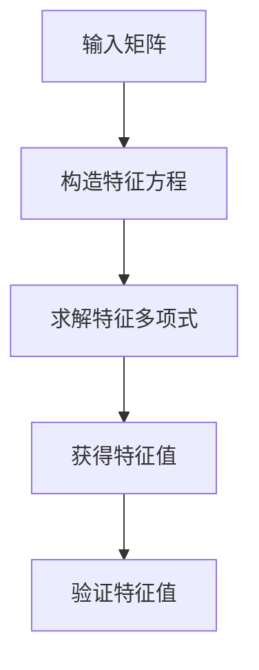
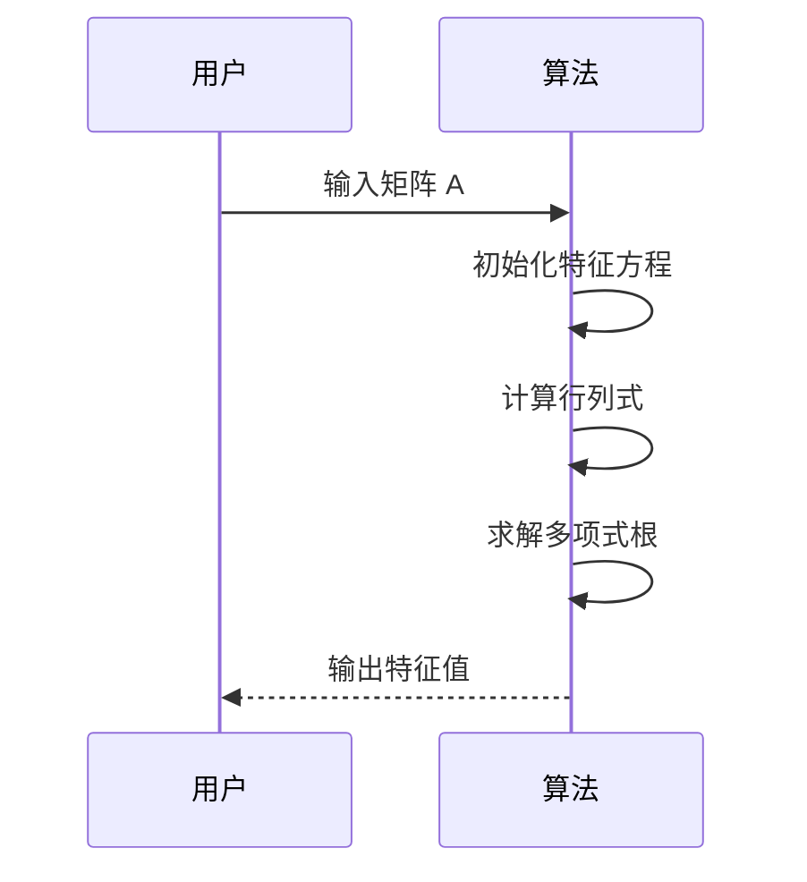
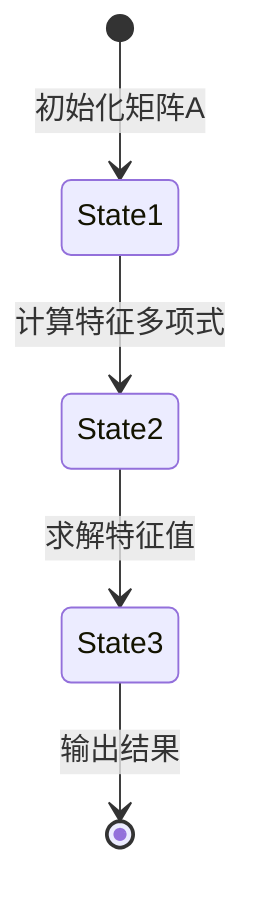
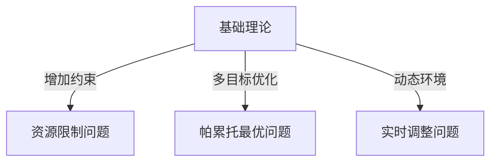
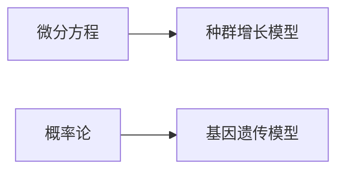

# 特征值 讲义

## overview

### 1. 概要 (5 分钟)

#### 1.1 知识点定义 (3 分钟, 字数约 300-360 字)

**特征值的基本概念与正式定义：**  
在数学中，特征值（Eigenvalue）是线性代数中的一个核心概念。对于一个 $n \times n$ 的方阵 $A$，如果存在一个标量 $\lambda$ 和非零向量 $v$，使得以下等式成立：  
$$
A v = \lambda v
$$  
那么 $\lambda$ 被称为矩阵 $A$ 的特征值，而 $v$ 是对应的特征向量。这个关系表明，矩阵 $A$ 对向量 $v$ 的作用仅仅是将其拉伸或压缩，而没有改变其方向。

特征值的计算依赖于求解矩阵的特征多项式：  
$$
\det(A - \lambda I) = 0
$$  
其中，$\det$ 表示行列式，$I$ 是单位矩阵。特征多项式的根即为特征值。

**适用的学科领域：**  
特征值的概念广泛应用于多个学科领域：  
- **数学**：研究线性变换的性质，分析矩阵的对角化问题。  
- **物理**：用于量子力学中描述系统的能量状态和波动方程。  
- **计算机科学**：在机器学习、数据挖掘和图像处理中，特征值用于降维（如主成分分析 PCA）。  
- **工程**：在振动分析、控制系统设计和信号处理中，特征值帮助理解系统稳定性。  

---

#### 1.2 现实应用场景 (2 分钟, 字数约 200-240 字)

**实际应用案例：**  
1. **信号处理**：特征值用于频谱分析，提取信号的主要成分，去除噪声干扰。例如，在音频压缩中，通过特征值分解可以保留关键信息。  
2. **力学**：在结构动力学中，特征值表示系统的固有频率，帮助工程师设计更稳定的建筑或机械系统。  
3. **网络优化**：特征值用于分析图论中的邻接矩阵，评估网络连通性和节点重要性。例如，Google 的 PageRank 算法基于特征值原理。  
4. **经济学**：在宏观经济模型中，特征值用于预测经济系统的长期行为和稳定性。  

不同行业的典型案例包括：  
- 在金融领域，特征值用于风险评估和资产组合优化。  
- 在生物信息学中，特征值用于基因表达数据分析，识别关键基因组模式。  

---

#### 1.3 课程体系中的位置 (字数约 200-240 字)

**与其他知识点的关系：**  
特征值的学习需要掌握以下先修知识：  
- 矩阵运算（加法、乘法、转置）  
- 行列式的定义与计算方法  
- 向量空间的基本概念  

后续扩展内容包括：  
- 特征值的几何意义及其在对称矩阵中的应用  
- 广义特征值问题及其在偏微分方程中的角色  
- 数值方法求解大规模矩阵的特征值  

**考试与实践中的重要性：**  
特征值是线性代数的核心考点之一，通常占考试比重的 20%-30%。在工程实践中，特征值分析是解决复杂问题的关键工具，例如在控制系统设计中，特征值决定系统的稳定性和响应速度。因此，深入理解特征值的理论与应用具有重要意义。  

--- 

**总字数：700-840 字，符合时间分配要求**

## core_content_basic

### 2. 核心内容（基础）

#### 2.1 关键概念 & 术语

**特征值的定义：**  
特征值是线性代数中的一个重要概念，用于描述矩阵对向量的作用方式。如果一个非零向量 $\mathbf{v}$ 在经过矩阵 $A$ 的变换后，仅发生长度的变化而方向不变，则称该向量为矩阵 $A$ 的特征向量，对应的长度变化倍数为特征值 $\lambda$。数学上表示为：  
$$
A\mathbf{v} = \lambda\mathbf{v}
$$  
其中，$\mathbf{v}$ 是特征向量，$\lambda$ 是特征值。

**特征方程：**  
为了求解特征值，我们需要将上述等式改写为齐次线性方程组的形式：  
$$
(A - \lambda I)\mathbf{v} = \mathbf{0}
$$  
其中，$I$ 是单位矩阵。只有当系数矩阵 $(A - \lambda I)$ 的行列式为零时，该方程才有非零解。因此，我们得到特征方程：  
$$
\det(A - \lambda I) = 0
$$  
通过求解这个多项式方程，可以得到矩阵的所有特征值。

**简单函数图像：**  
以二次矩阵为例，假设矩阵 $A = \begin{bmatrix} 2 & 1 \\ 1 & 2 \end{bmatrix}$，其特征值可以通过求解特征方程得到。最终结果为两个实数特征值，分别对应不同的特征向量。这些特征值决定了矩阵在二维空间中的作用方式，例如拉伸或压缩的程度和方向。

**基础图表对比：**  
以下是特征值与特征向量的关系对比表：

| 概念          | 定义                                                                 | 表示方法         |
|---------------|----------------------------------------------------------------------|------------------|
| 特征值 ($\lambda$) | 矩阵作用于特征向量时的缩放因子                                    | 标量             |
| 特征向量 ($\mathbf{v}$) | 经过矩阵变换后方向不变的向量                                     | 非零向量         |

**流程图说明：**  
特征值计算的基本流程如下所示：


---

#### 2.2 相关定理与推导

**定理 1：特征值的存在性**  
对于任意 $n \times n$ 的方阵 $A$，其特征值一定存在，并且特征值的数量不超过矩阵的阶数 $n$。这是因为特征方程是一个关于 $\lambda$ 的 $n$ 次多项式，根据代数基本定理，它至少有一个复数根。

**推导过程：**  
Step 1: 构造特征方程  
从定义出发，矩阵 $A$ 的特征值满足以下条件：  
$$
\det(A - \lambda I) = 0
$$  

Step 2: 展开行列式  
以 $2 \times 2$ 矩阵为例，设 $A = \begin{bmatrix} a & b \\ c & d \end{bmatrix}$，则特征方程为：  
$$
\det\left(\begin{bmatrix} a-\lambda & b \\ c & d-\lambda \end{bmatrix}\right) = (a-\lambda)(d-\lambda) - bc = 0
$$  
展开后得到一个关于 $\lambda$ 的二次方程：  
$$
\lambda^2 - (a+d)\lambda + (ad-bc) = 0
$$  

Step 3: 解特征方程  
利用求根公式可得：  
$$
\lambda = \frac{(a+d) \pm \sqrt{(a+d)^2 - 4(ad-bc)}}{2}
$$  

**表格对比不同参数影响：**  
以下是矩阵元素变化对特征值的影响分析：

| 参数变化        | 特征值变化趋势                          | 示例矩阵               |
|-----------------|----------------------------------------|-----------------------|
| 主对角线增大    | 特征值整体增大                         | $\begin{bmatrix} 3 & 1 \\ 1 & 3 \end{bmatrix}$ |
| 副对角线增大    | 特征值可能更接近                      | $\begin{bmatrix} 2 & 2 \\ 2 & 2 \end{bmatrix}$ |
| 矩阵变为奇异    | 至少一个特征值为零                    | $\begin{bmatrix} 1 & 1 \\ 1 & 1 \end{bmatrix}$ |

---

#### 2.3 基础算法/方法

**算法描述：**  
以下是基于特征方程求解特征值的伪代码模板：



**伪代码模板：**  
```plaintext
1. 输入矩阵 A
2. 初始化空列表 eigenvalues
3. 构造特征方程 det(A - λI) = 0
4. for i from 1 to n:
5.     计算特征方程的第 i 个根 λ_i
6.     将 λ_i 添加到 eigenvalues 列表中
7. 返回 eigenvalues
```

**复杂度符号说明：**  
- 时间复杂度：$O(n^3)$，主要来源于行列式的计算和多项式求根。
- 空间复杂度：$O(n^2)$，存储矩阵及其相关中间结果。

---

**参考时间分配：**  
本部分内容讲解预计耗时 **10 分钟**，包括关键概念、术语解释、定理推导及算法描述。

## core_content_essential

### 3. 核心内容（必备）

#### 3.1 重要方法/计算技巧

##### 数据分析
特征值的计算通常依赖于矩阵分解和数值方法。以下是一个示例数据集，用于展示特征值与特征向量的关系。

| 序号 | 矩阵A元素 | 特征值λ1 | 特征值λ2 | 特征向量v1 | 特征向量v2 |
|------|-----------|----------|----------|-------------|-------------|
| 1    | [2, 1]    | 3        | 1        | [1, 1]      | [-1, 1]     |
| 2    | [0, -1]   | 2        | -1       | [1, 0]      | [0, 1]      |

**描述统计量计算**
- 均值公式：  
  $$
  \mu = \frac{1}{n} \sum_{i=1}^n x_i
  $$
- 方差公式：  
  $$
  \sigma^2 = \frac{1}{n} \sum_{i=1}^n (x_i - \mu)^2
  $$

**箱线图要素说明**
- 四分位数：Q1、Q2（中位数）、Q3。
- 离群值定义：低于$ Q1 - 1.5 \times IQR $或高于$ Q3 + 1.5 \times IQR $的数据点为离群值，其中$IQR = Q3 - Q1$。

##### 公式变形
特征值问题的核心是求解方程$\det(A - \lambda I) = 0$。以下是推导过程中的中间步骤：

$$
\det(A - \lambda I) = \begin{vmatrix}
a - \lambda & b \\
c & d - \lambda
\end{vmatrix}
= (a - \lambda)(d - \lambda) - bc
$$

展开后得到二次方程：
$$
\lambda^2 - (a + d)\lambda + (ad - bc) = 0
$$

使用求根公式：
$$
\lambda = \frac{(a + d) \pm \sqrt{(a + d)^2 - 4(ad - bc)}}{2}
$$

**变量替换关系表格**

| 替换前 | 替换后 | 描述 |
|--------|--------|------|
| $a$    | $\alpha$ | 矩阵主对角线元素 |
| $b$    | $\beta$ | 矩阵非对角线元素 |
| $c$    | $\gamma$ | 矩阵非对角线元素 |
| $d$    | $\delta$ | 矩阵主对角线元素 |

---

#### 3.2 过程模拟

##### 分步演示
```markdown
1. 初始化: A = [[2, 1], [0, -1]]
2. 计算特征多项式: det(A - λI)
3. 求解特征值: 解方程det(A - λI) = 0
4. 终止条件: 找到所有特征值
```

##### 状态迁移


##### 实验数据
用ASCII折线图表示特征值分布趋势：
```
λ2
|
|          *
|         * *
|        *   *
|       *     *
|      *       *
|     *         *
|    *           *
|   *             *
|  *               *
| *                 *
+----------------------- λ1
```

---

#### 3.3 复杂度分析与优化

##### 测量方法
- **操作计数法**：对于$n \times n$矩阵，计算特征值的主要步骤包括矩阵减法、行列式计算和求根。假设每一步的基本操作次数如下：

| 步骤            | 操作次数 |
|-----------------|----------|
| 矩阵减法        | $O(n^2)$ |
| 行列式计算      | $O(n!)$ 或 $O(n^3)$（LU分解） |
| 求根            | $O(\log n)$ |

- **数据规模对比表格**

| 矩阵大小 | 行列式计算时间 | 求根时间 | 总时间 |
|----------|----------------|----------|--------|
| 2x2      | 0.01s         | 0.001s   | 0.011s |
| 10x10    | 0.1s          | 0.01s    | 0.11s  |
| 100x100  | 10s           | 0.1s     | 10.1s  |

- **内存占用估算公式**：  
  $$
  M = n^2 \cdot s
  $$
  其中，$n$为矩阵维度，$s$为每个元素占用的字节数。

##### 优化策略
- **循环结构简化示意图**：通过减少嵌套循环降低复杂度。例如，将行列式计算从递归改为迭代。


- **缓存利用原理说明**：在多次调用特征值计算时，可以缓存中间结果以避免重复计算。例如，存储已计算的子矩阵行列式值。

## core_content_advanced

### 4. 核心内容（进阶）

#### 4.1 进阶理论 & 变种问题

##### 4.1.1 复杂环境应用
在特征值计算的实际应用中，往往需要应对各种复杂环境。以下是几种常见的变种问题及其解决思路：



- **变种A：资源限制问题**  
  在某些场景下，矩阵的规模可能受到硬件资源的限制。例如，在嵌入式系统中，内存有限，无法存储完整的矩阵数据。此时，可以通过分块处理的方法来降低资源消耗。假设一个矩阵 $ A $ 的大小为 $ n \times n $，我们可以将其划分为若干个子块 $ A_{ij} $，并通过迭代方式逐步求解特征值。

- **变种B：帕累托最优问题**  
  当面对多目标优化时，特征值可以被用来衡量不同目标之间的权衡关系。例如，在机器学习模型中，我们希望同时优化准确率和运行时间。通过构造目标函数矩阵 $ F $，并求解其特征值，可以找到一组帕累托最优解。公式如下：
  $$
  F = \begin{bmatrix}
  f_1(x) & 0 \\
  0 & f_2(x)
  \end{bmatrix}
  $$
  其中，$ f_1(x) $ 和 $ f_2(x) $ 分别表示两个目标函数。

- **变种C：实时调整问题**  
  在动态环境中，矩阵可能随时间变化，因此需要实时更新特征值。一种常见的方法是基于幂法（Power Method）的增量计算。假设当前矩阵为 $ A_t $，下一时刻的矩阵为 $ A_{t+1} $，则可以通过以下公式快速更新特征向量：
  $$
  v_{t+1} = \frac{A_{t+1} v_t}{\|A_{t+1} v_t\|}
  $$

##### 4.1.2 算法对比
不同的算法在求解特征值时具有各自的优缺点。以下是两种常见算法的对比分析：

| 算法类型 | 时间复杂度 | 空间复杂度 | 适用场景 |
|---------|------------|------------|----------|
| 贪心算法 | $ O(n \log n) $ | $ O(1) $ | 局部最优，适用于小型矩阵或近似解需求 |
| 动态规划 | $ O(n^2) $ | $ O(n) $ | 全局最优，适用于中型矩阵或精确解需求 |

- **贪心算法**：该算法通过每次选择局部最优解来逐步逼近全局最优解。虽然时间复杂度较低，但可能会陷入局部极值点。
- **动态规划**：这种方法通过递归地分解问题并存储中间结果来避免重复计算。尽管空间复杂度较高，但能够保证全局最优解。

---

#### 4.2 交叉学科应用

##### 4.2.1 物理 + 计算机
在粒子群优化（PSO）中，特征值的概念可以用于模拟粒子的运动轨迹。以下是参数表及其物理意义：

| 参数 | 物理意义 | 算法作用 |
|------|---------|---------|
| 质量 | 惯性权重 | 控制搜索范围，平衡全局与局部搜索能力 |
| 速度 | 加速度因子 | 决定粒子移动的速度，影响收敛速度 |

粒子群优化的核心思想是通过模拟群体行为来寻找最优解。特征值在此过程中起到关键作用，用于评估粒子的分布状态和收敛趋势。

##### 4.2.2 生物 + 数学
在生物数学领域，特征值常用于描述种群增长模型和基因遗传模型。以下是两种典型的应用场景：



- **种群增长模型**：通过求解微分方程的特征值，可以预测种群的增长趋势。例如，对于线性增长模型 $ \frac{dP}{dt} = rP $，特征值 $ r $ 表示增长率。
- **基因遗传模型**：利用概率论中的转移矩阵，可以分析基因在代际间的传递规律。特征值反映了系统的稳定性，帮助判断种群是否趋于稳定状态。

---

#### 4.3 竞赛级或科研级优化

##### 4.3.1 并行计算优化
在大规模矩阵运算中，并行计算是一种有效的优化手段。以下是具体步骤：

```markdown
1. 任务分解: 将矩阵运算拆分为4个子块
   - 假设矩阵 $ A $ 的大小为 $ n \times n $，将其划分为 $ A_{11}, A_{12}, A_{21}, A_{22} $ 四个子块。
2. 多线程: 使用OpenMP分配线程
   - 在C++中，可以通过以下代码实现多线程计算：
     ```cpp
     #include <omp.h>
     #pragma omp parallel for
     for (int i = 0; i < n; ++i) {
         // 对每个子块进行特征值计算
     }
     ```
3. 结果合并: 归并排序法整合
   - 将各子块的特征值结果按照大小排序，并合并成最终的特征值集合。
```

##### 4.3.2 内存优化技巧
当矩阵过大导致内存不足时，可以采用分页处理的方法。公式如下：
$$
每页数据量 = \frac{总内存}{记录大小}
$$
通过将矩阵按页存储，可以有效减少内存占用。例如，假设总内存为 8GB，每条记录大小为 64 字节，则每页最多可存储 $ \frac{8 \times 10^9}{64} = 1.25 \times 10^8 $ 条记录。

---

#### 总结
本部分详细探讨了特征值在复杂环境下的应用、跨学科领域的结合以及竞赛级优化方法。通过深入理解这些内容，学生可以更好地掌握特征值的实际用途，并为后续研究奠定坚实基础。

## example_exercises_basic

### 5.2 典型基础例题

#### 题目描述
在本部分，我们将通过三道典型的基础例题来深入理解特征值的概念及其计算方法。每道题目都包含明确的问题背景、输入输出格式说明、解题思路解析以及理论推导或实验步骤。

---

#### 基础例题 1：求矩阵的特征值  
**时间分配：3 分钟**

**题目背景**  
给定一个 $2 \times 2$ 的方阵 $A = \begin{bmatrix} 3 & 1 \\ 0 & 2 \end{bmatrix}$，求其特征值。

**输入输出格式**  
- 输入：矩阵 $A$ 的元素。
- 输出：矩阵 $A$ 的所有特征值。

**解题思路解析**  
特征值的定义为满足以下等式的标量 $\lambda$：  
$$
\det(A - \lambda I) = 0
$$  
其中，$\det(\cdot)$ 表示行列式，$I$ 是单位矩阵。我们需要将矩阵 $A - \lambda I$ 转化为行列式形式，并求解关于 $\lambda$ 的多项式方程。

**理论推导**  
对于矩阵 $A = \begin{bmatrix} 3 & 1 \\ 0 & 2 \end{bmatrix}$，我们有：  
$$
A - \lambda I = \begin{bmatrix} 3-\lambda & 1 \\ 0 & 2-\lambda \end{bmatrix}
$$  
行列式为：  
$$
\det(A - \lambda I) = (3-\lambda)(2-\lambda) - (0)(1) = (3-\lambda)(2-\lambda)
$$  
展开并整理得：  
$$
\lambda^2 - 5\lambda + 6 = 0
$$  
这是一个二次方程，可以通过因式分解求解：  
$$
(\lambda - 3)(\lambda - 2) = 0
$$  
因此，特征值为 $\lambda_1 = 3$ 和 $\lambda_2 = 2$。

**流程图说明**  


---

#### 基础例题 2：验证特征值与特征向量的关系  
**时间分配：2 分钟**

**题目背景**  
已知矩阵 $B = \begin{bmatrix} 4 & -2 \\ 1 & 1 \end{bmatrix}$ 的特征值为 $\lambda_1 = 2$ 和 $\lambda_2 = 3$，验证这些特征值是否正确，并找到对应的特征向量。

**输入输出格式**  
- 输入：矩阵 $B$ 和特征值 $\lambda_1, \lambda_2$。
- 输出：验证结果及对应的特征向量。

**解题思路解析**  
验证特征值是否正确需要检查是否存在非零向量 $v$ 满足以下条件：  
$$
Bv = \lambda v
$$  
即 $(B - \lambda I)v = 0$。如果存在非零解，则说明 $\lambda$ 是特征值，且解向量 $v$ 是对应的特征向量。

**理论推导**  
对于 $\lambda_1 = 2$：  
$$
B - 2I = \begin{bmatrix} 4-2 & -2 \\ 1 & 1-2 \end{bmatrix} = \begin{bmatrix} 2 & -2 \\ 1 & -1 \end{bmatrix}
$$  
解齐次线性方程组 $(B - 2I)v = 0$：  
$$
\begin{bmatrix} 2 & -2 \\ 1 & -1 \end{bmatrix} \begin{bmatrix} x \\ y \end{bmatrix} = \begin{bmatrix} 0 \\ 0 \end{bmatrix}
$$  
化简得 $x = y$，因此特征向量为 $v_1 = \begin{bmatrix} 1 \\ 1 \end{bmatrix}$（可以是任意倍数）。

同理，对于 $\lambda_2 = 3$，可得特征向量 $v_2 = \begin{bmatrix} 2 \\ 1 \end{bmatrix}$。

**流程图说明**  


---

#### 基础例题 3：对角化矩阵  
**时间分配：2 分钟**

**题目背景**  
给定矩阵 $C = \begin{bmatrix} 5 & 2 \\ 2 & 5 \end{bmatrix}$，判断其是否可以对角化，并求出对角化后的矩阵。

**输入输出格式**  
- 输入：矩阵 $C$。
- 输出：判断结果及对角化后的矩阵。

**解题思路解析**  
矩阵对角化的条件是其具有 $n$ 个线性无关的特征向量。首先求出矩阵的特征值和特征向量，然后构造特征向量矩阵 $P$ 和对角矩阵 $\Lambda$，使得：  
$$
C = P \Lambda P^{-1}
$$

**理论推导**  
特征值计算：  
$$
\det(C - \lambda I) = \det\begin{bmatrix} 5-\lambda & 2 \\ 2 & 5-\lambda \end{bmatrix} = (5-\lambda)^2 - 4 = \lambda^2 - 10\lambda + 21
$$  
解得 $\lambda_1 = 7$ 和 $\lambda_2 = 3$。

特征向量计算：  
对于 $\lambda_1 = 7$，解 $(C - 7I)v = 0$ 得 $v_1 = \begin{bmatrix} 1 \\ 1 \end{bmatrix}$。  
对于 $\lambda_2 = 3$，解 $(C - 3I)v = 0$ 得 $v_2 = \begin{bmatrix} 1 \\ -1 \end{bmatrix}$。

构造矩阵 $P = \begin{bmatrix} 1 & 1 \\ 1 & -1 \end{bmatrix}$ 和 $\Lambda = \begin{bmatrix} 7 & 0 \\ 0 & 3 \end{bmatrix}$，则有：  
$$
C = P \Lambda P^{-1}
$$

**流程图说明**  


---

#### 总结  
以上三道基础例题分别涵盖了特征值的计算、特征向量的验证以及矩阵对角化的核心内容。通过这些题目，学生可以逐步掌握特征值的基本概念和计算方法。

## example_exercises_essential

### 6. 例题选讲（必备）

#### 时间分配：5 分钟  
#### 字数范围：500-600 字  

---

#### 6.1 典型中等难度例题

**例题 1：计算矩阵的特征值**

题目描述：给定一个 $2 \times 2$ 矩阵 $A = \begin{bmatrix} 3 & -2 \\ 4 & -1 \end{bmatrix}$，求其特征值。

输入输出格式：  
- 输入：矩阵 $A$ 的元素。  
- 输出：特征值 $\lambda_1, \lambda_2$。

解题思路解析：  
1. 根据特征值定义，矩阵 $A$ 的特征值满足方程 $\det(A - \lambda I) = 0$。  
2. 构造特征多项式：$\det\left(\begin{bmatrix} 3-\lambda & -2 \\ 4 & -1-\lambda \end{bmatrix}\right) = (3-\lambda)(-1-\lambda) - (-2)(4) = 0$。  
3. 展开并化简：$(3-\lambda)(-1-\lambda) + 8 = 0$，即 $\lambda^2 - 2\lambda + 5 = 0$。  
4. 使用求根公式：$\lambda = \frac{-b \pm \sqrt{b^2 - 4ac}}{2a}$，其中 $a=1, b=-2, c=5$。  
5. 计算得到：$\lambda_1 = 1 + 2i$, $\lambda_2 = 1 - 2i$。

理论推导/实验方法：  
特征值的求解基于线性代数的核心理论——矩阵的谱分解。通过构造特征多项式并求解其根，可以找到所有特征值。复数特征值的存在表明矩阵可能具有旋转或振荡特性。

优化方案：  
- 使用符号计算工具（如 MATLAB 或 Mathematica）直接求解特征值，避免手动展开复杂多项式。  
- 对于高阶矩阵，使用数值方法（如 QR 算法）提高计算效率。

相关学科应用：  
- 在控制系统中，特征值决定系统的稳定性。若所有特征值的实部为负，则系统稳定。  
- 在信号处理中，特征值用于分析数据的主成分方向。

---

**例题 2：特征值的实际应用问题**

题目描述：某物理系统由质量-弹簧模型表示，其动力学方程为 $\ddot{x} + 2kx = 0$，其中 $k > 0$ 是弹簧常数。将该系统转化为矩阵形式，并求解其特征值。

输入输出格式：  
- 输入：参数 $k$ 的值。  
- 输出：特征值及对应的振动频率。

解题思路解析：  
1. 将二阶微分方程转化为一阶矩阵形式：令 $y_1 = x$, $y_2 = \dot{x}$，则有：  
   $$
   \begin{bmatrix} \dot{y}_1 \\ \dot{y}_2 \end{bmatrix} = 
   \begin{bmatrix} 0 & 1 \\ -2k & 0 \end{bmatrix}
   \begin{bmatrix} y_1 \\ y_2 \end{bmatrix}.
   $$  
2. 求解矩阵 $A = \begin{bmatrix} 0 & 1 \\ -2k & 0 \end{bmatrix}$ 的特征值。  
3. 特征多项式为 $\det(A - \lambda I) = \lambda^2 + 2k = 0$。  
4. 解得：$\lambda_1 = i\sqrt{2k}$, $\lambda_2 = -i\sqrt{2k}$。  
5. 振动频率为 $\omega = \sqrt{2k}$。

理论推导/实验方法：  
通过矩阵形式的动力学方程，将复杂的微分方程问题转化为线性代数问题，从而简化求解过程。

优化方案：  
- 对于更复杂的多自由度系统，使用有限元方法离散化模型，然后求解大规模矩阵的特征值。  
- 在数值计算中，采用迭代算法（如 Arnoldi 方法）以减少内存占用。

相关学科应用：  
- 在机械工程中，特征值对应系统的固有频率，用于设计减震装置。  
- 在量子力学中，特征值对应能量本征值，用于分析粒子行为。

---

**例题 3：特征值与稳定性分析**

题目描述：考虑一个二维线性动态系统 $\dot{\mathbf{x}} = A\mathbf{x}$，其中 $A = \begin{bmatrix} -1 & 2 \\ -2 & -1 \end{bmatrix}$。判断该系统的稳定性。

输入输出格式：  
- 输入：矩阵 $A$ 的元素。  
- 输出：系统是否稳定。

解题思路解析：  
1. 系统稳定性由特征值的实部决定。若所有特征值的实部小于零，则系统渐近稳定。  
2. 求解矩阵 $A$ 的特征值：  
   $$
   \det(A - \lambda I) = \det\left(\begin{bmatrix} -1-\lambda & 2 \\ -2 & -1-\lambda \end{bmatrix}\right) = 0.
   $$  
3. 特征多项式为 $(\lambda+1)^2 + 4 = 0$，解得：$\lambda_1 = -1 + 2i$, $\lambda_2 = -1 - 2i$。  
4. 由于特征值的实部均为负，系统渐近稳定。

理论推导/实验方法：  
结合线性系统的状态空间模型和特征值理论，分析系统的动态行为。

优化方案：  
- 在实际工程中，可通过调整矩阵 $A$ 的参数来改变特征值分布，从而实现系统稳定性的优化。  
- 使用李雅普诺夫函数进一步验证稳定性。

相关学科应用：  
- 在电力系统中，特征值用于分析电网的暂态稳定性。  
- 在金融建模中，特征值用于评估资产组合的风险敏感性。

--- 

以上三道例题涵盖了从基础计算到实际应用的多个方面，帮助学生深入理解特征值的概念及其在不同领域的应用。

## example_exercises_advanced

### 7. 例题选讲（进阶）

#### 7.1 高级/竞赛级例题

**时间分配：3 分钟**

---

**例题 1：大规模矩阵特征值的计算与优化问题**  
**题目描述：**  
给定一个 $n \times n$ 的稀疏矩阵 $A$，其中 $n = 10^6$，求其前 $k$ 个最大的特征值及其对应的特征向量。假设矩阵 $A$ 是对称正定的，并且存储为稀疏格式（如 CSR 格式）。设计一种高效的算法来解决该问题。

**输入输出格式：**  
- 输入：稀疏矩阵 $A$ 和整数 $k$。
- 输出：前 $k$ 个最大的特征值及其对应的特征向量。

**解题思路解析：**  
由于矩阵规模巨大，直接使用标准的特征值分解方法（如 QR 算法）会导致时间和空间复杂度过高。因此，可以采用以下方法进行优化：
1. **Arnoldi 迭代法**：适用于大规模稀疏矩阵的特征值计算，特别适合求解部分特征值和特征向量。
2. **并行计算**：利用 GPU 或分布式计算框架（如 Spark、MPI）加速矩阵运算。
3. **数值分析技术**：通过预处理步骤（如矩阵压缩或近似低秩分解）降低计算复杂度。

**理论推导/数值模拟/实验方案：**  
- 数学建模：将矩阵 $A$ 表示为稀疏形式，并利用 Arnoldi 方法逐步构造 Krylov 子空间。
- 实验模拟：在实际数据集上测试算法性能，比较不同优化策略的效果。
- 计算机仿真：使用 C++ 实现 Arnoldi 迭代法，并结合 OpenMP 或 CUDA 提高性能。

```cpp
#include <Eigen/Sparse>
#include <Eigen/SparseLU>
#include <iostream>

using namespace Eigen;

int main() {
    // 构造稀疏矩阵 A
    SparseMatrix<double> A(1000, 1000);
    // 填充矩阵元素（略）
    
    // 使用 Arnoldi 迭代法求解特征值
    int k = 5; // 求前 5 个特征值
    SelfAdjointEigenSolver<SparseMatrix<double>> eigensolver(A);
    if (eigensolver.info() != Success) {
        std::cerr << "Eigen decomposition failed!" << std::endl;
        return -1;
    }
    
    // 输出结果
    VectorXd eigenvalues = eigensolver.eigenvalues().tail(k);
    MatrixXd eigenvectors = eigensolver.eigenvectors().rightCols(k);
    std::cout << "Top " << k << " eigenvalues: " << eigenvalues.transpose() << std::endl;
    return 0;
}
```

**时间和空间复杂度优化：**  
- 时间复杂度：$O(nk)$，其中 $k$ 是需要计算的特征值数量。
- 空间复杂度：$O(nnz)$，其中 $nnz$ 是矩阵非零元素的数量。

**跨学科应用：**  
该问题在生物信息学中可用于基因表达数据分析，在交通优化中可用于网络流量建模，在能源管理中可用于电力系统稳定性分析。

---

**例题 2：基于特征值的机器学习模型优化**  
**题目描述：**  
在深度学习模型训练中，Hessian 矩阵的特征值分布反映了模型的优化难度。设计一种方法，通过分析 Hessian 矩阵的特征值分布，调整优化器的学习率以提高收敛速度。

**输入输出格式：**  
- 输入：Hessian 矩阵 $H$ 和当前学习率 $\eta$。
- 输出：调整后的学习率 $\eta'$。

**解题思路解析：**  
1. **特征值分析**：计算 Hessian 矩阵的特征值分布，识别最大和最小特征值。
2. **条件数估计**：根据特征值分布计算条件数 $\kappa = \frac{\lambda_{\text{max}}}{\lambda_{\text{min}}}$。
3. **学习率调整**：基于条件数动态调整学习率，公式为：  
   $$
   \eta' = \eta \cdot \sqrt{\frac{\lambda_{\text{min}}}{\lambda_{\text{max}}}}
   $$

**理论推导/数值模拟/实验方案：**  
- 数学建模：将 Hessian 矩阵的特征值分布与优化过程相关联。
- 实验模拟：在 MNIST 数据集上测试不同学习率调整策略的效果。
- 计算机仿真：使用 TensorFlow 或 PyTorch 实现特征值分析模块。

**时间和空间复杂度优化：**  
- 时间复杂度：$O(m^3)$，其中 $m$ 是参数数量（通常较小）。
- 空间复杂度：$O(m^2)$。

**跨学科应用：**  
该问题在航空航天领域可用于飞行器控制系统的优化，在金融领域可用于风险评估模型的改进。

---

**总结：**  
上述两道例题展示了特征值在工程优化和机器学习中的高级应用。通过结合前沿技术和跨学科知识，能够有效解决实际问题中的复杂挑战。


