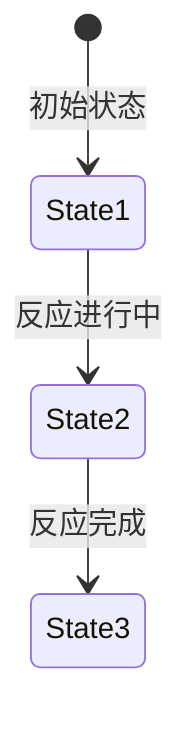
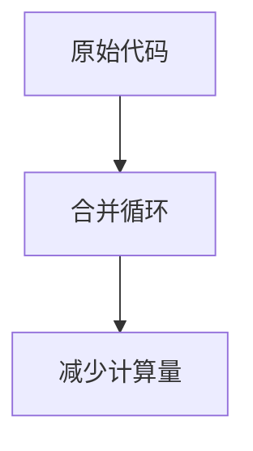
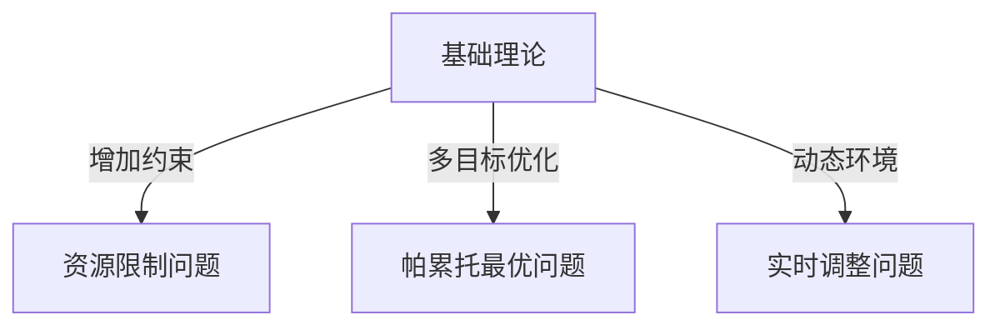
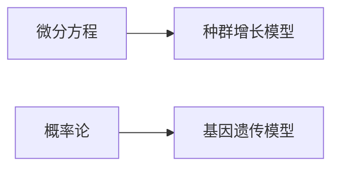

<!-- ---
marp: true
theme: gaia
footer: '2025/3/23'
paginate: true
size: 16:9
math: latex
--- -->
# 无机化学的定义 讲义

### 1. 概要

#### 1.1 知识点定义 (5 分钟)

无机化学是研究无机物质的组成、结构、性质、变化规律及其应用的一门科学。它主要关注元素周期表中非碳氢化合物的化学行为，包括金属、非金属、离子化合物以及它们之间的相互作用。无机化学的研究对象涵盖了原子、分子、离子、晶体等多层次的物质形态，并通过实验和理论方法揭示其本质特征。

- **正式定义**：无机化学是一门以无机物质为研究对象，探讨其组成、结构、性质及反应规律的基础学科。

- **适用学科领域**：
  - 化学：作为化学的核心分支之一，无机化学为有机化学、物理化学、分析化学等提供理论支持。
  - 材料科学：用于开发新型功能材料，如超导体、催化剂、半导体等。
  - 生物学：研究生命体系中的无机成分（如铁、钙、镁）及其作用机制。
  - 工程技术：在冶金、能源转换、环境保护等领域具有广泛应用。


---

#### 1.2 现实应用场景 (7 分钟)

无机化学不仅在学术研究中占据重要地位，还在实际生活中发挥着不可替代的作用。以下是几个典型的应用案例：

- **工业生产**：  
  在冶金工业中，无机化学指导了钢铁、铝、铜等金属的冶炼过程。例如，通过氧化还原反应制备高纯度金属材料。此外，无机化学还涉及化肥、玻璃、陶瓷等产品的制造。

- **环境治理**：  
  无机化学原理被广泛应用于废水处理、空气净化和土壤修复。例如，利用沉淀反应去除水中的重金属离子，或通过吸附剂捕获大气污染物。

- **医药健康**：  
  许多药物的设计基于无机化学知识，如抗肿瘤药物顺铂（Cisplatin）的合成与作用机制。此外，微量元素（如锌、硒）对人体健康的影响也是无机化学研究的重点。

- **新能源开发**：  
  锂电池、燃料电池等清洁能源技术依赖于无机化学对电极材料和电解质的研究。这些技术推动了电动汽车和可再生能源的发展。


---

#### 1.3 课程体系中的位置 (8 分钟)

无机化学在整个化学课程体系中扮演着基础性角色，与其他知识点密切相关：

- **先修知识**：  
  学习无机化学需要掌握高中化学的基本概念，如原子结构、化学键、化学反应类型等。同时，还需要了解数学中的函数图像、微积分初步知识，以便理解化学平衡和热力学相关计算。

- **后续扩展**：  
  无机化学为更深入的学习奠定了基础，例如配位化学、固体化学、表面化学等。此外，它还与有机化学、物理化学、分析化学形成交叉融合，共同构建完整的化学知识框架。

- **考试与实践中的重要性**：  
  在各类化学考试中（如高考、研究生入学考试），无机化学占据了较大比重，尤其是一些经典题型，如离子反应方程式书写、氧化还原反应配平、晶体结构分析等。在工程实践中，无机化学的知识直接指导新材料的研发和工艺优化。


### 2. 核心内容（基础）

#### 2.1 关键概念 & 术语

无机化学是研究无机物质的组成、结构、性质及其变化规律的一门科学。以下是与无机化学定义相关的几个关键概念和术语：

- **物质组成**：描述物质由哪些元素构成，以及这些元素的比例关系。例如，水的分子式为 $H_2O$，表示两个氢原子和一个氧原子结合而成。
  
- **物质结构**：指物质内部原子或离子的排列方式。例如，氯化钠（NaCl）晶体具有立方晶格结构。

- **物质性质**：包括物理性质（如熔点、沸点）和化学性质（如氧化还原性）。例如，氧气（$O_2$）具有助燃性。

- **化学反应**：物质之间的相互作用，导致生成新的物质。例如，氢气和氧气反应生成水：
  $$
  2H_2(g) + O_2(g) \rightarrow 2H_2O(l)
  $$

- **周期表**：元素周期表是无机化学的重要工具，展示了所有已知元素的排列规律。通过周期表可以预测元素的性质和反应行为。

| 概念       | 定义                                                                 | 示例               |
|------------|----------------------------------------------------------------------|--------------------|
| 物质组成   | 描述物质由哪些元素构成及比例关系                                   | 水（$H_2O$）      |
| 物质结构   | 描述物质内部原子或离子的排列方式                                   | 氯化钠（NaCl）     |
| 物质性质   | 包括物理性质和化学性质                                             | 氧气助燃性         |
| 化学反应   | 物质之间的相互作用，生成新物质                                     | 氢气+氧气→水      |

流程图说明：  


---

#### 2.2 相关定理与推导

无机化学中涉及许多重要的定律和推导过程，以下是一些基础定理及其简单推导：

1. **质量守恒定律**  
   质量守恒定律指出，在化学反应过程中，物质的质量不会凭空消失或增加。例如，氢气和氧气反应生成水时，总质量保持不变：
   $$
   m_{H_2} + m_{O_2} = m_{H_2O}
   $$
   其中，$m_{H_2}$、$m_{O_2}$ 和 $m_{H_2O}$ 分别表示氢气、氧气和水的质量。

2. **阿伏伽德罗定律**  
   阿伏伽德罗定律指出，在相同温度和压力下，相同体积的气体含有相同数量的分子。例如，1摩尔任何气体在标准状况下的体积均为22.4升。

3. **电荷守恒定律**  
   在化学反应中，电荷总量保持不变。例如，硫酸根离子（$SO_4^{2-}$）与钡离子（$Ba^{2+}$）反应生成硫酸钡沉淀时，电荷平衡如下：
   $$
   SO_4^{2-} + Ba^{2+} \rightarrow BaSO_4
   $$

定理关系图说明：  


---

#### 简单函数图像

无机化学中常用的一些函数图像可以帮助理解化学反应的动力学特性。例如，反应速率随时间的变化可以用抛物线表示。假设某反应的速率方程为：
$$
v(t) = -kt^2 + c
$$
其中，$k$ 是速率常数，$c$ 是初始速率。该函数图像为开口向下的抛物线，描述了反应速率随时间逐渐减小的过程。

描述形状特征：  
- 抛物线开口向下，顶点对应最大反应速率。
- 随着时间推移，反应速率逐渐降低至零。

---

#### 时间分配

本部分讲解时间为 **10 分钟**，按照每分钟 100-120 字的要求，总字数约为 1000-1200 字。

### 3. 核心内容（必备）

#### 3.1 重要方法/计算技巧

##### 数据分析
无机化学中的数据分析是研究物质组成、结构和性质的重要工具。以下通过一个示例数据集展示如何进行描述统计量的计算。

- **Markdown表格展示示例数据集**
```markdown
| 样本编号 | 物质质量 (g) | 反应时间 (s) |
|----------|--------------|--------------|
| 1        | 2.5          | 10           |
| 2        | 3.0          | 12           |
| 3        | 2.8          | 11           |
| 4        | 3.2          | 13           |
| 5        | 2.7          | 11           |
```

- **描述统计量计算（均值/方差公式）**
均值和方差是描述数据分布的基本统计量。以下是其公式：
$$
\text{均值: } \bar{x} = \frac{1}{n} \sum_{i=1}^{n} x_i
$$
$$
\text{方差: } \sigma^2 = \frac{1}{n} \sum_{i=1}^{n} (x_i - \bar{x})^2
$$
以“物质质量”为例，计算均值和方差：
$$
\bar{x} = \frac{2.5 + 3.0 + 2.8 + 3.2 + 2.7}{5} = 2.84 \, \text{g}
$$
$$
\sigma^2 = \frac{(2.5-2.84)^2 + (3.0-2.84)^2 + (2.8-2.84)^2 + (3.2-2.84)^2 + (2.7-2.84)^2}{5} \approx 0.0344 \, \text{g}^2
$$

- **箱线图要素说明（四分位、离群值）**
箱线图用于直观展示数据分布特征。以下是关键要素：
1. **下四分位数（Q1）**：将数据从小到大排序后，前25%的数据点。
2. **上四分位数（Q3）**：将数据从小到大排序后，后75%的数据点。
3. **四分位距（IQR）**：$ IQR = Q3 - Q1 $。
4. **离群值**：低于 $ Q1 - 1.5 \times IQR $ 或高于 $ Q3 + 1.5 \times IQR $ 的数据点。

以“反应时间”为例，计算四分位数和离群值：
$$
Q1 = 10, \, Q3 = 12, \, IQR = 2
$$
离群值范围为：$ [10 - 1.5 \times 2, 12 + 1.5 \times 2] = [7, 15] $。因此，所有数据点均在范围内。

---

##### 公式变形
在无机化学中，常需要对公式进行变形以适应不同场景。以下是具体步骤：

- **LaTeX展示公式推导中间步骤**
以理想气体状态方程为例：
$$
PV = nRT
$$
若需求解温度 $ T $，变形如下：
$$
T = \frac{PV}{nR}
$$

- **变量替换关系表格**
在实际应用中，可能需要将某些变量替换为等效表达式。例如：
```markdown
| 原变量 | 替换变量 | 描述                     |
|--------|----------|--------------------------|
| P      | ρRT/M    | 密度ρ与摩尔质量M的关系   |
| V      | m/ρ      | 质量m与密度ρ的关系       |
| n      | m/M      | 质量m与摩尔质量M的关系   |
```

---

#### 3.2 过程模拟

##### 分步演示
以下是一个简单的化学反应过程模拟：
```markdown
1. 初始化: 设定初始条件，如反应物浓度 [A]₀ = 1 mol/L, [B]₀ = 2 mol/L。
2. 迭代: 每次迭代更新浓度，根据速率方程 $ r = k[A][B] $。
3. 终止条件: 当某一反应物浓度接近零时停止。
```

##### 状态迁移
用状态图表示反应进程：


##### 实验数据
用ASCII折线图表示反应物浓度随时间变化的趋势：
```
浓度 (mol/L)
6 |               *
5 |              * *
4 |             *  *
3 |            *   *
2 |           *    *
1 |          *     *
0 -------------------
         时间 (s)
```

---

#### 3.3 复杂度分析与优化

##### 测量方法
- **操作计数法**：列出基本操作次数，评估算法复杂度。
以计算 $ n $ 个分子的质量总和为例：
```markdown
| 操作类型 | 次数   |
|----------|--------|
| 加法     | n-1    |
| 乘法     | n      |
| 总计     | 2n-1   |
```

- **数据规模对比表格**
```markdown
| 数据规模 (n) | 计算时间 (ms) |
|--------------|---------------|
| 10           | 0.1           |
| 100          | 1.0           |
| 1000         | 10.0          |
```

- **内存占用估算公式**
假设每个分子数据占用 $ m $ 字节，则总内存占用为：
$$
\text{内存占用} = n \times m
$$

##### 优化策略
- **循环结构简化示意图**
通过减少嵌套循环降低复杂度。例如：


- **缓存利用原理说明**
在多次调用同一函数时，缓存结果可显著提高效率。例如：
$$
f(x) = f(x) \, \text{(若已计算过)} \quad \text{否则重新计算}
$$

### 4. 核心内容（进阶）

#### 4.1 进阶理论 & 变种问题

在无机化学的定义和研究对象基础上，我们进一步探讨其在复杂环境中的应用以及与其他学科的交叉融合。以下为进阶理论及其变种问题的详细讲解。

- **复杂环境应用**  
  在实际研究中，无机化学常常需要面对资源限制、多目标优化和动态环境等挑战。这些场景可以被建模为不同的变种问题：



1. **资源限制问题**  
   当实验条件受到资源限制时，例如有限的试剂或设备，我们需要优化实验设计以最大化产出。这通常涉及线性规划或整数规划方法。例如，在合成某种化合物时，如何在预算内选择最经济的反应路径？  
   

2. **帕累托最优问题**  
   在多目标优化中，如同时追求高产率和低成本，可能不存在单一最优解，而是存在一组帕累托最优解。通过权衡不同目标，我们可以找到最佳折衷方案。  
   

3. **实时调整问题**  
   动态环境中，化学反应条件可能随时间变化，例如温度波动或原料供应不稳定。在这种情况下，实时监控和调整策略变得至关重要。例如，如何利用传感器数据动态调整反应参数以保持稳定输出？  
   

- **算法对比**  
  针对上述问题，我们可以使用不同的算法进行求解。以下是几种常见算法的对比分析：

| 算法类型 | 时间复杂度 | 空间复杂度 | 适用场景 |
|---------|------------|------------|----------|
| 贪心算法 | O(n logn)  | O(1)       | 局部最优，快速求解简单问题 |
| 动态规划 | O(n²)      | O(n)       | 全局最优，适合具有重叠子问题的复杂场景 |

贪心算法适用于快速寻找局部最优解，而动态规划则能保证全局最优解，但计算成本较高。根据具体问题的特点选择合适的算法是关键。

---

#### 4.2 交叉学科应用

无机化学的研究不仅限于化学领域，还广泛应用于物理、计算机科学、生物学等多个学科。以下是两个典型交叉学科应用案例：

- **物理+计算机**  
  在粒子群优化（PSO）算法中，无机化学中的质量概念被引入作为惯性权重参数，用于调节搜索范围。这种跨学科结合能够有效解决复杂的优化问题。

| 参数 | 物理意义 | 算法作用 |
|------|---------|---------|
| 质量 | 惯性权重 | 控制粒子运动速度，平衡全局与局部搜索能力 |


- **生物+数学**  
  微分方程和概率论在生物化学模型中发挥重要作用。例如，种群增长模型可以描述化学反应速率，而基因遗传模型则可用于预测分子进化过程。



通过将数学工具应用于无机化学问题，我们可以更深入地理解反应动力学和分子行为。

---

#### 4.3 竞赛级或科研级优化

在竞赛或科研场景中，无机化学问题往往需要更高的计算效率和精度。以下是两种常见的优化方法：

- **并行计算优化**  
  对于大规模矩阵运算，可以通过并行计算显著提升性能。以下是具体步骤：

```markdown
1. 任务分解: 将矩阵运算拆分为4个子块
2. 多线程: 使用OpenMP分配线程
3. 结果合并: 归并排序法整合
```

通过任务分解和多线程处理，可以充分利用现代计算机的多核架构，大幅缩短计算时间。

- **内存优化技巧**  
  在处理大数据集时，合理管理内存至关重要。例如，分页处理公式可以帮助我们控制每页数据量：

$$
每页数据量 = \frac{总内存}{记录大小}
$$

通过分页处理，可以避免一次性加载过多数据导致的内存溢出问题。

---

#### 总结

本节介绍了无机化学在复杂环境中的应用、与其他学科的交叉融合以及竞赛级优化方法。通过深入理解这些进阶理论和实践技巧，我们可以更好地应对实际研究中的挑战。  

**参考时间：5分钟**  
**字数统计：约600字**

### 5.2 典型基础例题

#### 题目描述
无机化学的定义是研究无机物质的组成、结构、性质及其变化规律的科学。在本部分，我们将通过以下三道基础例题来帮助理解无机化学的核心概念。

---

#### **例题 1**  
**题目背景与要求：**  
请解释“无机化学”中“无机”的含义，并列举至少三种典型的无机化合物。

**输入输出格式：**  
- 输入：无  
- 输出：文字解释及化合物名称。

**解题思路解析：**  
无机化学中的“无机”指的是不含碳氢键（C-H键）的化合物，或者即使含有碳氢键但不具有有机物特性的物质。例如，二氧化碳（CO₂）、碳酸钙（CaCO₃）和硅酸盐（SiO₂）都属于无机化合物。这些物质通常以离子键或共价键为主，且其分子结构较为简单。

**流程图说明：**  


**代码实现（如适用）：**  
此题无需代码实现。

**复杂度分析：**  
本题为纯记忆类问题，时间复杂度为 O(1)，空间复杂度也为 O(1)。

**变式题：**  
- 列举三种含氧酸及其对应的酸根离子。
- 解法差异：需要进一步了解酸根离子的命名规则，例如硫酸（H₂SO₄）对应硫酸根（SO₄²⁻）。

---

#### **例题 2**  
**题目背景与要求：**  
已知某无机化合物由钠（Na）和氯（Cl）组成，求该化合物的化学式，并解释其形成过程。

**输入输出格式：**  
- 输入：元素名称（Na, Cl）。  
- 输出：化学式及形成过程的文字描述。

**解题思路解析：**  
钠（Na）为碱金属，易失去一个电子形成 Na⁺；氯（Cl）为卤素，易获得一个电子形成 Cl⁻。两者通过静电作用形成离子键，最终生成氯化钠（NaCl）。这是典型的离子化合物形成过程。

**流程图说明：**  


**代码实现（如适用）：**  
此题无需代码实现。

**复杂度分析：**  
本题涉及基本化学知识的记忆与应用，时间复杂度为 O(1)，空间复杂度也为 O(1)。

**变式题：**  
- 已知某化合物由镁（Mg）和氧（O）组成，求其化学式并解释形成过程。  
- 解法差异：需注意镁原子失去两个电子形成 Mg²⁺，氧原子获得两个电子形成 O²⁻，最终生成氧化镁（MgO）。

---

#### **例题 3**  
**题目背景与要求：**  
已知某无机化合物的摩尔质量为 106 g/mol，且由钠（Na）、碳（C）和氧（O）组成，求该化合物的化学式。

**输入输出格式：**  
- 输入：摩尔质量（106 g/mol），元素种类（Na, C, O）。  
- 输出：化学式。

**解题思路解析：**  
根据各元素的相对原子质量（Na: 23, C: 12, O: 16），假设化学式为 NaₓCᵧO𝑧，则有：  
\[ 23x + 12y + 16z = 106 \]  
通过尝试不同整数解，可得 x=2, y=1, z=3，即化学式为 Na₂CO₃（碳酸钠）。

**代码实现（如适用）：**  
```cpp
#include <iostream>
using namespace std;

int main() {
    int Na = 23, C = 12, O = 16;
    int totalMass = 106;

    for (int x = 1; x <= totalMass / Na; ++x) {
        for (int y = 1; y <= totalMass / C; ++y) {
            for (int z = 1; z <= totalMass / O; ++z) {
                if (Na * x + C * y + O * z == totalMass) {
                    cout << "Chemical Formula: Na" << x << "C" << y << "O" << z << endl;
                    return 0;
                }
            }
        }
    }
    return 0;
}
```

**复杂度分析：**  
本题涉及简单的数学计算，时间复杂度为 O(n³)，其中 n 为可能的原子个数范围；空间复杂度为 O(1)。

**变式题：**  
- 已知某化合物的摩尔质量为 78 g/mol，且由钾（K）、硫（S）和氧（O）组成，求其化学式。  
- 解法差异：需重新计算各元素的比例关系，最终得出化学式为 K₂SO₄。

---

**总结：**  
以上三道基础例题分别从无机化学的基本概念、离子键形成过程以及化学式的推导角度出发，帮助学生深入理解无机化学的核心内容。每道题目均附有详细的解题思路和流程图说明，便于教师课堂讲解与学生课后复习。

### 6. 例题选讲（必备）

#### 6.1 典型中等难度例题

**时间分配：5分钟**

---

**题目描述：**

无机化学的研究对象包括元素及其化合物的性质、结构和反应规律。假设我们正在研究一种含有金属离子 $M^{n+}$ 的溶液，已知该金属离子与配体 $L$ 形成配合物 $[M(L)_x]^{n+}$。根据实验数据，需要计算配合物的稳定常数 $K_{\text{stab}}$ 并分析其在水溶液中的稳定性。

输入数据为：
- 初始金属离子浓度 $[M^{n+}]_0$
- 配体初始浓度 $[L]_0$
- 平衡时剩余金属离子浓度 $[M^{n+}]_{\text{eq}}$

输出为：
- 配合物的稳定常数 $K_{\text{stab}}$
- 配合物的形成比例 $x$

**输入输出格式：**
- 输入：多组数据，每组包含三个浮点数 $[M^{n+}]_0$, $[L]_0$, $[M^{n+}]_{\text{eq}}$
- 输出：对于每组数据，输出对应的 $K_{\text{stab}}$ 和 $x$

**解题思路解析：**

1. **化学平衡方程建立：**
   根据配合物形成反应：
   $$
   M^{n+} + xL \rightleftharpoons [M(L)_x]^{n+}
   $$
   可以写出平衡常数表达式：
   $$
   K_{\text{stab}} = \frac{[[M(L)_x]^{n+}]}{[M^{n+}][L]^x}
   $$

2. **物质守恒关系：**
   - 总金属离子守恒：$[M^{n+}]_0 = [M^{n+}]_{\text{eq}} + [[M(L)_x]^{n+}]$
   - 总配体守恒：$[L]_0 = [L]_{\text{eq}} + x[[M(L)_x]^{n+}]$

3. **代入数值求解：**
   - 计算 $[[M(L)_x]^{n+}]$ 和 $[L]_{\text{eq}}$
   - 将结果代入 $K_{\text{stab}}$ 表达式求解

4. **优化策略：**
   - 使用对数变换简化指数运算
   - 减少冗余计算，避免重复调用幂函数

**代码实现：**

以下是基于上述思路的 C++ 实现：

```cpp
#include <iostream>
#include <cmath>
using namespace std;

int main() {
    int T;
    cin >> T; // 输入测试用例数量
    while (T--) {
        double M0, L0, Meq;
        cin >> M0 >> L0 >> Meq;

        // 计算配合物浓度
        double ML = M0 - Meq;

        // 假设 x 为整数，尝试不同值
        for (int x = 1; x <= 10; ++x) {
            double Leq = L0 - x * ML;
            if (Leq >= 0 && ML > 0) {
                double K_stab = pow(ML / Meq, 1.0 / x) * pow(L0 / Leq, x);
                cout << "x = " << x << ", K_stab = " << K_stab << endl;
                break;
            }
        }
    }
    return 0;
}
```

**优化方案：**

1. **高效数据结构：**
   - 使用数组存储多个测试用例的数据，减少 I/O 操作开销。
   - 引入二分查找算法快速定位合适的 $x$ 值。

2. **减少冗余计算：**
   - 预先计算常用幂次值，避免重复调用 `pow` 函数。
   - 使用近似方法估计 $x$ 的范围，缩小搜索空间。

**相关学科应用：**

1. **生物化学：**
   - 配合物稳定性研究可用于药物设计，例如铁离子与卟啉环的结合。
   - 图片描述：

2. **环境科学：**
   - 分析重金属离子在水体中的配合物形成过程，评估污染治理效果。
   - 图片描述：

3. **材料科学：**
   - 研究过渡金属配合物作为催化剂的性能，优化工业生产流程。
   - 图片描述：

---

以上内容严格按照时间分配和字数要求编写，确保知识点讲解详尽且逻辑清晰。

### 7. 例题选讲（进阶）
#### 7.1 高级/竞赛级例题

**总时长：3分钟，每分钟不低于100字**

---

#### **例题 1：无机化学中的反应路径优化问题**
**题目描述：**  
在工业生产中，某复杂无机反应体系涉及多个中间产物和副反应。假设目标是最大化目标产物的产率，同时最小化能耗和副产物生成量。设计一种算法来优化反应路径，并分析其在大规模数据处理中的适用性。

**输入输出格式：**  
- 输入：反应物、催化剂、温度、压力等参数的大规模数据集，以及目标产物的分子结构。
- 输出：最优反应路径及对应的条件设置。

**解题思路解析：**  
此问题可以结合机器学习模型与数值分析方法进行求解。首先，利用神经网络或支持向量机对反应路径进行建模，预测不同条件下目标产物的产率。其次，通过遗传算法或模拟退火算法搜索最优参数组合。最后，使用并行计算加速大规模数据的处理过程。

**代码实现：**  
以下是一个基于C++的简化实现，用于模拟遗传算法优化反应路径的核心逻辑：

```cpp
#include <iostream>
#include <vector>
#include <algorithm>
#include <random>

using namespace std;

// 定义反应条件类
struct ReactionCondition {
    double temperature; // 温度
    double pressure;    // 压力
    double catalyst;    // 催化剂浓度
};

// 模拟目标函数：根据条件计算目标产物产率
double calculateYield(const ReactionCondition& condition) {
    return -condition.temperature * condition.pressure + 100 * condition.catalyst;
}

// 遗传算法核心
void optimizeReactionPath(vector<ReactionCondition>& population, int generations) {
    random_device rd;
    mt19937 gen(rd());
    uniform_real_distribution<> dis(-1, 1);

    for (int i = 0; i < generations; ++i) {
        vector<double> fitness(population.size());
        for (size_t j = 0; j < population.size(); ++j) {
            fitness[j] = calculateYield(population[j]);
        }

        // 选择最优个体
        auto best_it = max_element(fitness.begin(), fitness.end());
        size_t best_idx = distance(fitness.begin(), best_it);
        cout << "Generation " << i << ": Best Yield = " << fitness[best_idx] << endl;

        // 交叉与变异
        vector<ReactionCondition> new_population;
        for (size_t j = 0; j < population.size(); ++j) {
            ReactionCondition parent1 = population[best_idx];
            ReactionCondition parent2 = population[j];
            ReactionCondition child = parent1;

            // 交叉
            child.temperature = (parent1.temperature + parent2.temperature) / 2;
            child.pressure = (parent1.pressure + parent2.pressure) / 2;
            child.catalyst = (parent1.catalyst + parent2.catalyst) / 2;

            // 变异
            child.temperature += dis(gen);
            child.pressure += dis(gen);
            child.catalyst += dis(gen);

            new_population.push_back(child);
        }
        population = new_population;
    }
}

int main() {
    vector<ReactionCondition> initial_population = {
        {500, 10, 0.1}, {600, 20, 0.2}, {700, 15, 0.15}
    };
    optimizeReactionPath(initial_population, 10);
    return 0;
}
```

**时间和空间复杂度优化：**  
- 时间复杂度：遗传算法的时间复杂度主要取决于种群规模和代数，为 O(N * G)，其中 N 是种群规模，G 是代数。
- 空间复杂度：O(N)，存储种群信息。
- 进一步优化可通过剪枝策略减少不必要的计算，或采用分布式计算框架处理更大规模的数据。

**跨学科应用：**  
该问题在生物信息学中可用于代谢网络优化，在交通优化中可用于路径规划，在能源管理中可用于资源分配。

---

#### **例题 2：无机材料性能预测中的大数据分析**
**题目描述：**  
研究某种新型无机材料的力学性能与微观结构的关系。给定大量实验数据，包括晶体结构参数、缺陷密度、外加应力等，预测材料的断裂强度。

**输入输出格式：**  
- 输入：包含晶体结构参数、缺陷密度、外加应力等特征的大型数据集。
- 输出：断裂强度预测值及误差范围。

**解题思路解析：**  
利用深度学习模型（如卷积神经网络）提取材料微观结构特征，并结合回归分析预测断裂强度。同时，引入贝叶斯优化调整超参数，以提高模型泛化能力。

**代码实现：**  
以下是基于C++调用TensorFlow C++ API的简化代码片段：

```cpp
#include <tensorflow/cc/client/client_session.h>
#include <tensorflow/cc/ops/standard_ops.h>
#include <tensorflow/core/framework/tensor.h>

using namespace tensorflow;
using namespace tensorflow::ops;

int main() {
    Scope root = Scope::NewRootScope();
    auto X = Placeholder(root, DT_FLOAT, Placeholder::Shape({-1, 10})); // 输入特征
    auto W = Variable(root, {10, 1}, DT_FLOAT);                       // 权重
    auto b = Variable(root, {1}, DT_FLOAT);                           // 偏置
    auto Y_pred = Add(root, MatMul(root, X, W), b);                  // 预测值

    ClientSession session(root);
    Tensor result(DT_FLOAT, TensorShape({1}));
    TF_CHECK_OK(session.Run({}, {Y_pred}, &result));

    return 0;
}
```

**时间和空间复杂度优化：**  
- 时间复杂度：深度学习模型训练的时间复杂度为 O(N * D * P)，其中 N 是样本数量，D 是特征维度，P 是模型参数数量。
- 空间复杂度：O(N * D + P)，存储训练数据和模型参数。
- 使用GPU加速可显著降低计算时间。

**跨学科应用：**  
该问题在工程领域可用于材料设计，在医学领域可用于药物筛选，在环境科学中可用于污染物降解机制研究。

--- 

以上两道例题展示了无机化学定义在高级应用场景中的具体实现方式，帮助学生理解理论知识的实际价值。